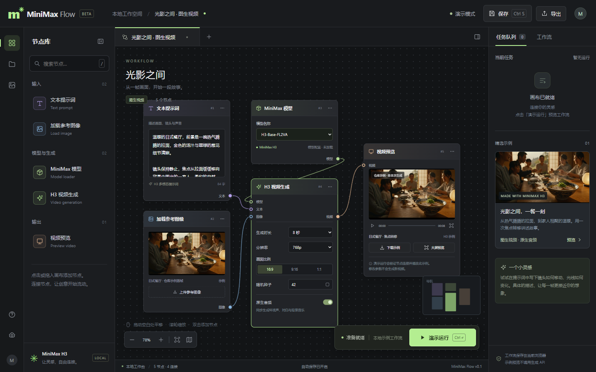

# MiniMax Flow

参考 ComfyUI 交互方式制作的 MiniMax H3 本地节点工作台。原生 HTML、CSS、JavaScript + Node.js，无需安装前端依赖。



## 启动

下载项目后，进入包含 `server.mjs` 的目录执行（Node.js 18 或以上）：

```powershell
node server.mjs
```

浏览器打开 http://127.0.0.1:8188 。Windows 也可双击 `启动工作台.cmd`。服务仅监听本机地址。

端口已占用时，PowerShell 中设置 `$env:PORT = '8189'` 后再次启动。

## 已实现

- 文本、参考图像、H3 模型配置、视频生成参数和视频预览节点。
- 节点拖拽、画布平移与缩放、同类型端口连线、连线删除、小地图、适应画布。
- 搜索和拖入节点、复制和删除节点、撤销、新建与重命名工作流。
- 文生视频 / 图生视频模板、参数编辑、参考图像上传。
- 自动保存到当前浏览器、导入和导出 JSON；上传图像随工作流保存。
- 校验工作流连接的演示运行、停止、会话记录，以及仓库视频播放和下载。
- 窄屏布局、键盘快捷键、减少动画偏好。

## 运行范围

当前版本是**可交互的本地 UI 与演示执行器**，未接入 MiniMax API 或加载本地模型。演示运行使用 `assets/i2va.mp4`，不会根据提示词生成新视频，不会发送生成请求或产生 API 费用。模型、时长、分辨率等参数会保存到 JSON，示例视频不随这些参数变化。

H3 模型可选项来自本仓库说明。2K 是后续接入云端重生成流程的配置项，本界面不会执行该流程。

参考图像支持 PNG、JPEG、WebP，每张最多 2 MB；工作流最多 100 个节点，导入文件最多 8 MB。浏览器存储空间不足时会显示导出提醒。清除浏览器数据会删除本地工作流，请先导出备份。

## 快捷键

| 操作 | 快捷键 |
| --- | --- |
| 保存 | Ctrl / Cmd + S |
| 演示运行 / 停止 | Ctrl / Cmd + Enter |
| 撤销画布编辑 | Ctrl / Cmd + Z |
| 删除所选节点 | Delete / Backspace |
| 适应画布 | F |
| 搜索节点 | / |
| 取消连线 | Esc |

拖动节点标题移动节点；拖动空白处平移。点击输出端口，再点击同色输入端口完成连线；双击连线删除。编辑文本时使用浏览器原生撤销。

## 验证

```powershell
node --check app.js
node --check server.mjs
```

启动服务后，可使用已有 Playwright 安装运行交互回归检查（无需为运行工作台安装它）：

```powershell
node check.mjs "C:\path\to\node_modules\playwright"
```

Windows 检查默认使用 Microsoft Edge；其他系统使用 Playwright Chromium。可用 `BROWSER_PATH` 指定浏览器，`TEST_URL` 指定测试地址。

## 项目结构

```text
app.js                节点交互、工作流保存与演示执行
index.html            工作台页面
style.css             界面样式
server.mjs            本地静态服务，支持视频分段请求
启动工作台.cmd        Windows 启动入口
assets/               三个 MiniMax H3 示例视频
docs/workbench.png    界面截图
check.mjs             浏览器交互回归检查
```

## 来源

界面交互参考 [ComfyUI](https://docs.comfy.org/interface/overview)。模型说明和演示视频来自 [MiniMax-AI/MiniMax-H3](https://github.com/MiniMax-AI/MiniMax-H3)，详见 [THIRD_PARTY_NOTICES.md](THIRD_PARTY_NOTICES.md)。这是独立制作的 UI 项目，不是 MiniMax 或 ComfyUI 官方客户端。
